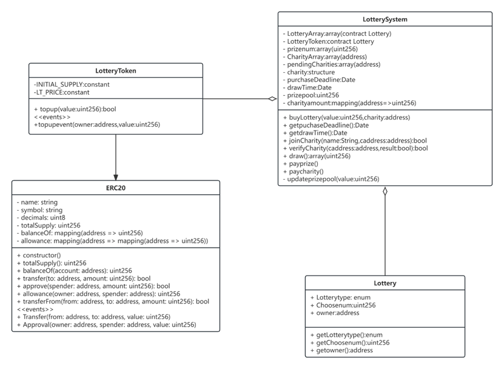
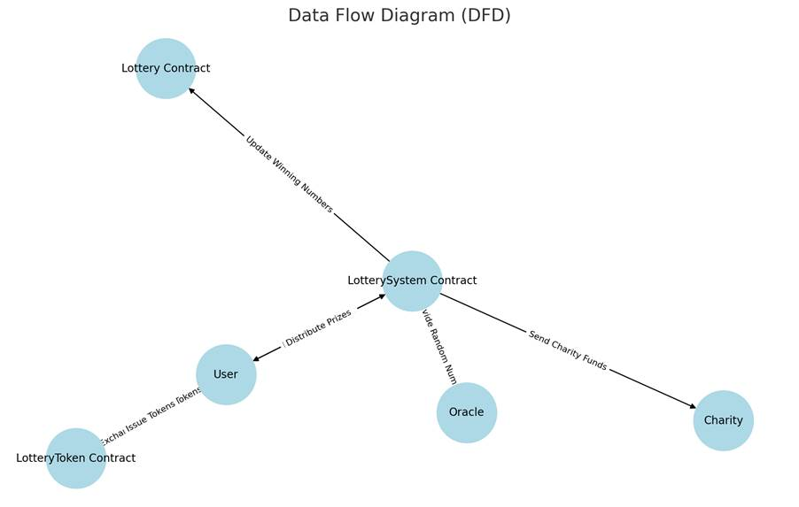
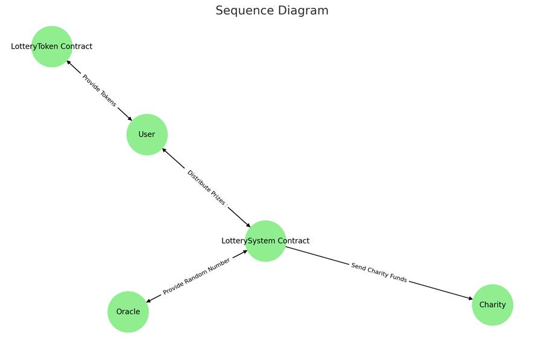
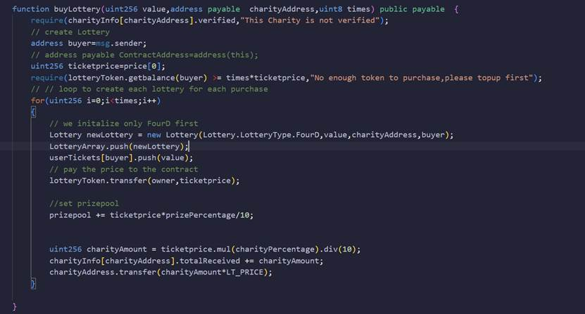
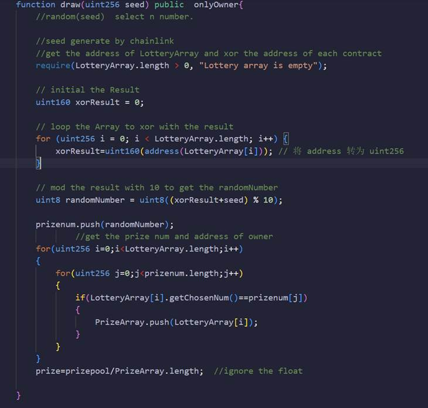
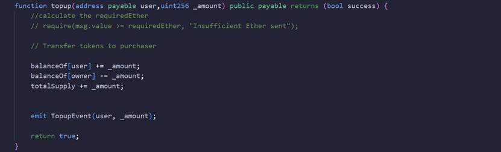

# 1. TechnicaImplementation

## 1.1 System Architecture Overview

This lottery system is built on the Ethereum blockchain platform and utilizes smart contracts to create a decentralized lottery system. The architecture consists of the following primary modules:

-  **ERC20 Standard Contract**: Provides the foundationafunctionality for LotteryToken, including token issuance, transfer, and authorization.

- **LotteryToken Contract**: Handles the exchange of Ether for LotteryTokens, which are used as currency to purchase lottery tickets.And this contract is inheritant of ERC20.

-  **LotterySystem Contract**: The main contract responsible for ticket purchasing, prize poomanagement, random number generation for lottery draws, and prize distribution.In this contract,charities are able to upload their information and wait for the eth from each lottery. 

- **Lottery Contract**: Manages the details of individualotteries, including lottery type, selected numbers, and ownership.

-  **Utility Module (SafeMath)**: Ensures safe mathematicaoperations to prevent overflow errors.

### 2.2 Contract Interaction Logic

Fig 2.1 UML of the Program

- **LotteryToken Contract** handles token purchases using the *topup* function, allowing users to exchange Ether for tokens.

- Users purchase lottery tickets via the *buyLottery* function in the **LotterySystem Contract**, and the funds are deposited into the prize pool.

- Each **Lottery Contract** instance records the user’s ticket selection and purchase details.

- The lottery draw uses the *draw* function in **LotterySystem Contract**, which calls an oracle to generate a random number.

The prize poois distributed to the contract creator, the winner, and the user-selected charity via the *payprize* function.

### 1.3 FunctionaDetails

1.  LotteryToken Contract
   - **Purpose**: Implements the ERC20 token standard for managing tokens.
   - **Key Functions**:
     - ***topup(value: uint256)\***: Allows users to exchange a specified amount of Ether for tokens.
     - Standard ERC20 functions: ***transfer\******,\*** ***approve\******,\*** ***transferFrom\***.
2. LotterySystem Contract
   - Purpose:
     - Facilitates lottery ticket purchases and records lottery data.
     - Generates random numbers for lottery draws using an oracle.
     - Distributes prize poofunds and supports charity selection.
   - Key Functions:
     - **buyLottery(value: uint256, charity: address)\***: Allows users to purchase lottery tickets and select a charity.
     - **draw()**: Generates a random winning number.
     - **payprize()**: Allocates funds from the prize pooto the contract creator, winner, and charity.
     -  **joinCharity(name: string, cAddress: address)**: Registers new charities.
3.  Lottery Contract
   - **Purpose**: Records details of individualotteries.
   - **Key** **Functions**:
     - **getChosenNum()**: Retrieves the user’s chosen numbers.
     -  **getChosenNum()**: Retrieves the user’s chosen numbers.
     - **getLotteryType()** Returns the type of lottery.

### 2.4. TechnicaImplementation Diagrams

A.   Data Flow Diagram

Fig 2.2 Data Flow Diagram 

B.   Sequence Diagram

Fig 2.3 Sequence Diagram

### 2.5 Key Code Snippets

LotterySystem.sol

**BuyLottery**:In this function,user can buy the lottery via the token they topup.When user execute this function,he or she can put the value of lottery,charity address(The charity they want to pay for) and the times of buy as argument.Then,contract wilautomatically create Lottery contract for the User and pay the 20% of their payment as charity ether.This charity ether wilpay for the charity address in this step.Here is the implementation of this function:
 

Fig2.4 The implementation of buylottery function

**Draw:**This function is used to generate the prize number.In the beginning of this program.We just simplify generate a random number by using our own algorithm combining with seed generate from the chainlink.Our algorithm is get the address of each Lottery contract and Exclusive OR them to get a number of uint160.Then mod the number with 10 to get a random number from 0-9.After that,operate with the seed number to make it more random.Here is the code in the draw function：

Fig 2.5 Draw function

LotteryToken.sol

Topup:This function is an interface used by LotterySystem.For the user, they do not know the presence of this contract.And this function wilbe used in the LotterySystem to buy token for each user.Here is the code of this function:

Fig 2.6 topup function

### 2.6  AdditionaFeatures

**Oracle Integration**: Incorporates Chainlink or similar services to ensure fair and secure random number generation.

**Charity Management**: Enhances the system by adding authentication and verification processes for charities.

**Frontend Interface**: Develops a user-friendly interface for token purchases, lottery participation, and winner result checks.